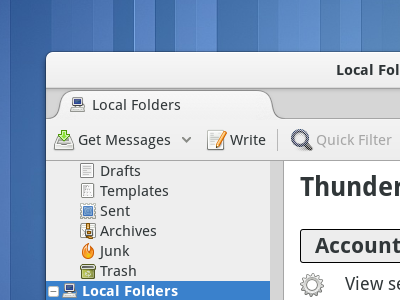

## GLWT for Thunderbird

Third-party lightweight theme with colors from the Adwaita theme.

It's a fork of GNOME themes for [Thunderbird](https://github.com/gnome-integration-team/thunderbird-gnome) and [Firefox](https://github.com/gnome-integration-team/firefox-gnome).

## How to build

You can use __make-xpi.py__ script to build xpi and clean temporary files:

```Bash
$ ./make-xpi.py [TARGET]
$ python3 make-xpi.py [TARGET]
```

Available targets: _all_, _theme_, _extension_ and _clean_. Default is _all_.

For more details please check [this page](https://github.com/seleznev/firefox-complete-theme-build-system#firefox-complete-theme-build-system).

## Screenshots


